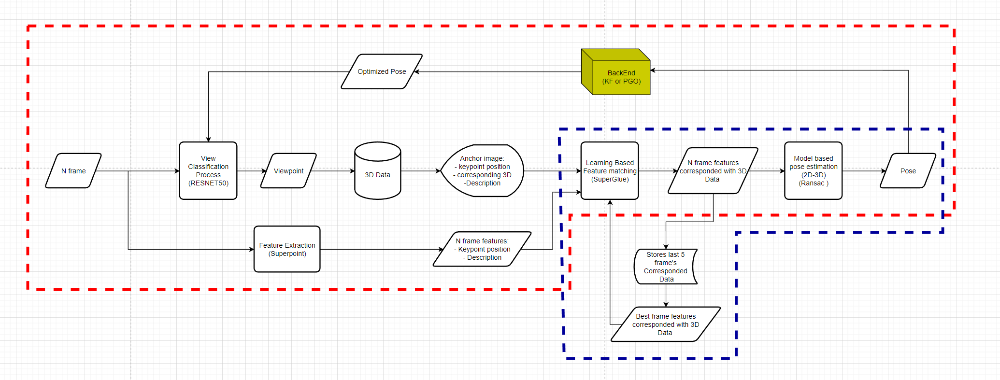
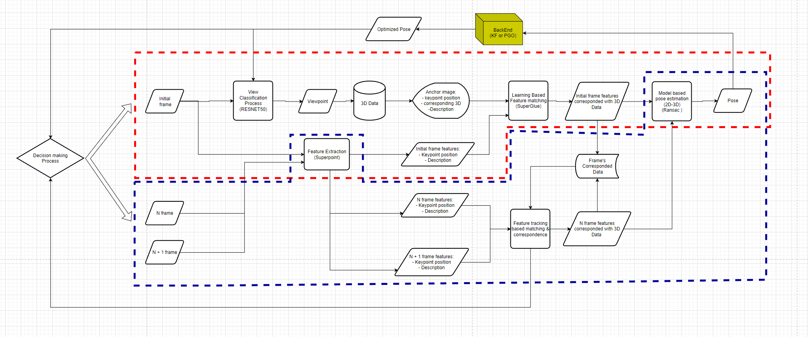

# RUUN_GLUE
Pose estimation using deep features and matchers.
#
#

# Guide to the Pose Estimation Code

This guide explains the purpose of each script in your pose estimation project and provides detailed explanations of the functions within each script, focusing on their inputs, outputs, and intuitive purposes.

---

## Overview

The project consists of the following scripts:

- **`main.py`**: The main script that orchestrates the pose estimation process.
- **`utils.py`**: Contains utility functions used across the project.
- **`kalman_filter.py`**: Implements a Kalman filter for smoothing pose estimates.
- **`pose_estimator.py`**: Contains the `PoseEstimator` class, which handles keypoint detection, matching, and pose estimation.

---

Requirements

The project relies on the following dependencies and system configurations:

Python Version

Python 3.11.10

CUDA Version

CUDA 12.2, release 12.2, build 12.2.140

Key Dependencies

Below is the list of major Python packages required for the project, along with their versions:

PyTorch: For deep learning computations.

torch==2.4.1+cu121

torchaudio==2.4.1+cu121

torchvision==0.19.1+cu121

SuperPoint and SuperGlue: For keypoint detection and feature matching.

Included as part of the project and relies on PyTorch.

OpenCV: For image and video processing.

opencv-python==4.10.0.84

NumPy: For numerical computations.

numpy==2.1.1

Matplotlib: For visualizations.

matplotlib==3.9.2

Kornia: For geometric transformations and image processing.

kornia==0.7.4

For a complete list of dependencies, see the requirements.txt file.

## Script Details

### 1. `main.py`

**Purpose:**  
The main script that runs the pose estimation process. It parses command-line arguments, initializes the `PoseEstimator`, processes the input video or image sequence, and handles visualization and output.

#### Key Components:

- **Argument Parsing:**  
  Uses `argparse` to parse command-line arguments for input video, anchor image, output directory, and various parameters related to the SuperPoint and SuperGlue models.

- **Device Setup:**  
  Determines whether to run on CPU or GPU based on availability and user input.

- **PoseEstimator Initialization:**  
  Creates an instance of the `PoseEstimator` class with the specified options.

- **Video Processing Loop:**  
  Opens the input video file or camera, reads frames in a loop, and processes each frame using the `PoseEstimator`.

- **Visualization and Output:**  
  Displays the pose estimation results (if enabled) and saves the output frames and pose data to files.

#### Main Flow:

1. **Parse Arguments:**  
   - **Inputs:** Command-line arguments.  
   - **Outputs:** An `opt` object containing all options.  
   - **Purpose:** Configures the pose estimation process based on user input.

2. **Set Device:**  
   - Determines whether to use CPU or GPU.  
   - Moves computation to the selected device.

3. **Initialize PoseEstimator:**  
   - **Inputs:** `opt`, `device`.  
   - **Outputs:** An instance of `PoseEstimator`.

4. **Open Video Capture:**  
   - **Inputs:** Video file path or camera index.  
   - **Outputs:** A `cv2.VideoCapture` object.

5. **Processing Loop:**  
   - Reads frames one by one.  
   - Calls `pose_estimator.process_frame(frame, frame_idx)` for each frame.  
   - Handles visualization and saving of results.

6. **Cleanup:**  
   - Releases video capture.  
   - Destroys OpenCV windows.  
   - Saves pose data to a JSON file.

---

### 2. `utils.py`

**Purpose:**  
Provides utility functions that are used across the project, such as image preprocessing, unique filename generation, and rotation conversions.

---

#### Functions:

1. **`frame2tensor(frame, device)`**  
   - **Purpose:** Converts an image frame to a normalized tensor suitable for input to the neural network models.  
   - **Inputs:**  
     - `frame`: The input image frame (NumPy array).  
     - `device`: The device to which the tensor should be moved (`'cpu'` or `'cuda'`).  
   - **Outputs:**  
     - `tensor`: A PyTorch tensor representing the normalized grayscale image, with shape `(1, 1, H, W)` and moved to the specified device.  
   - **Description:**  
     The function checks if the frame is empty, converts it to grayscale if necessary, normalizes the pixel values to the range `[0, 1]`, and converts it to a PyTorch tensor.

---

2. **`create_unique_filename(directory, base_filename)`**  
   - **Purpose:** Generates a unique filename in the specified directory by appending a counter to the base filename if necessary.  
   - **Inputs:**  
     - `directory`: The directory in which to check for existing files.  
     - `base_filename`: The desired filename (string), which may be modified to ensure uniqueness.  
   - **Outputs:**  
     - `new_filename`: A unique filename that does not conflict with existing files in the directory.  
   - **Description:**  
     The function checks if a file with the base filename exists in the directory. If it does, it appends a counter (e.g., `_1`, `_2`, etc.) before the file extension until it finds a unique filename.

---

3. **`rotation_matrix_to_euler_angles(R)`**  
   - **Purpose:** Converts a rotation matrix to Euler angles (roll, pitch, yaw).  
   - **Inputs:**  
     - `R`: A 3x3 rotation matrix (NumPy array).  
   - **Outputs:**  
     - `angles`: A NumPy array containing the Euler angles `[roll, pitch, yaw]` in radians.  
   - **Description:**  
     The function computes the Euler angles from the rotation matrix, handling the case where the matrix is singular (i.e., when `sy` is close to zero).

---

4. **`euler_angles_to_rotation_matrix(theta)`**  
   - **Purpose:** Converts Euler angles (roll, pitch, yaw) to a rotation matrix.  
   - **Inputs:**  
     - `theta`: A sequence or array containing the Euler angles `[roll, pitch, yaw]` in radians.  
   - **Outputs:**  
     - `R`: A 3x3 rotation matrix (NumPy array).  
   - **Description:**  
     The function constructs the rotation matrix by multiplying the individual rotation matrices around the X, Y, and Z axes corresponding to the provided Euler angles.

---

### 3. `kalman_filter.py`

**Purpose:**  
Implements a Kalman filter for smoothing the pose estimates over time. The Kalman filter helps to reduce noise and provide more stable pose estimates by considering both the current measurement and the predicted state.

---

#### Class: `KalmanFilterPose`

- **Purpose:**  
  Encapsulates the Kalman filter logic for pose estimation, handling the prediction and correction steps.

---

#### Initialization:

- **Inputs:**  
  - `dt`: The time step between frames (inverse of frame rate).  
  - `n_states`: The number of state variables (default is 18).  
  - `n_measurements`: The number of measurement variables (default is 6).  

- **Description:**  
  Initializes the Kalman filter with the specified state and measurement dimensions and sets up the transition matrix, measurement matrix, and covariance matrices.

---

#### Methods:

1. **`_init_kalman_filter(self)`**  
   - **Purpose:**  
     Initializes the Kalman filter matrices, including the transition matrix, measurement matrix, process noise covariance, measurement noise covariance, and initial state.  
   - **Inputs:**  
     - None (uses class attributes).  
   - **Outputs:**  
     - None (modifies the Kalman filter instance).  
   - **Description:**  
     Sets up the Kalman filter with appropriate matrices based on the physics of motion and the expected measurement types (position and orientation).

---

2. **`predict(self)`**  
   - **Purpose:**  
     Performs the prediction step of the Kalman filter, estimating the next state based on the current state and the transition model.  
   - **Inputs:**  
     - None.  
   - **Outputs:**  
     - `translation_estimated`: The predicted translation vector (NumPy array of shape `(3,)`).  
     - `eulers_estimated`: The predicted Euler angles (NumPy array of shape `(3,)`).  
   - **Description:**  
     Calls the Kalman filter's predict method and extracts the estimated translation and rotation (in Euler angles) from the predicted state.

---

3. **`correct(self, tvec, R)`**  
   - **Purpose:**  
     Performs the correction step of the Kalman filter, updating the state estimate based on the new measurements.  
   - **Inputs:**  
     - `tvec`: The measured translation vector (NumPy array of shape `(3, 1)`).  
     - `R`: The measured rotation matrix (NumPy array of shape `(3, 3)`).  
   - **Outputs:**  
     - None (updates the Kalman filter's state).  
   - **Description:**  
     Converts the rotation matrix to Euler angles, constructs the measurement vector, and calls the Kalman filter's correct method to update the state estimate.

---

### 4. `pose_estimator.py`

**Purpose:**  
Contains the `PoseEstimator` class, which handles keypoint detection using SuperPoint, feature matching using SuperGlue, pose estimation using PnP algorithms, and applies the Kalman filter to smooth the estimates.

---

#### Class: `PoseEstimator`

- **Purpose:**  
  Manages the entire pose estimation process for each frame, including feature extraction, matching, pose computation, and visualization.

---

#### Initialization:

- **Inputs:**  
  - `opt`: The options parsed from command-line arguments (an `argparse.Namespace` object).  
  - `device`: The device to run computations on (`'cpu'` or `'cuda'`).  

- **Description:**  
  Initializes the matching models, loads the anchor image and extracts its features, matches the anchor keypoints with known 3D points, and initializes the Kalman filter.

---

#### Methods:

1. **`_init_matching(self)`**  
   - **Purpose:**  
     Initializes the SuperPoint and SuperGlue models for feature detection and matching.  
   - **Inputs:**  
     - None.  
   - **Outputs:**  
     - `matching`: An instance of the `Matching` class configured with SuperPoint and SuperGlue parameters.  
   - **Description:**  
     Creates a configuration dictionary based on the provided options and initializes the matching model.

---

2. **`_load_anchor_image(self)`**  
   - **Purpose:**  
     Loads and preprocesses the anchor (reference) image.  
   - **Inputs:**  
     - None.  
   - **Outputs:**  
     - `anchor_image`: The loaded and resized anchor image (NumPy array).  
     - `anchor_tensor`: The anchor image converted to a tensor and moved to the specified device.  
   - **Description:**  
     Reads the anchor image from the provided path, resizes it according to the options, and converts it to a tensor.

---

3. **`_extract_anchor_features(self)`**  
   - **Purpose:**  
     Extracts keypoints and descriptors from the anchor image using SuperPoint.  
   - **Inputs:**  
     - None.  
   - **Outputs:**  
     - `keypoints`: The detected keypoints in the anchor image (NumPy array of shape `(N, 2)`).  
     - `descriptors`: The corresponding descriptors for the keypoints (NumPy array of shape `(256, N)`).  
     - `scores`: The confidence scores for each keypoint (NumPy array).  
   - **Description:**  
     Runs the SuperPoint model on the anchor image tensor to obtain keypoints, descriptors, and scores.

---

4. **`_match_anchor_keypoints(self)`**  
   - **Purpose:**  
     Matches the anchor keypoints with provided 2D keypoints and associates them with known 3D points.  
   - **Inputs:**  
     - None.  
   - **Outputs:**  
     - `matched_anchor_keypoints`: The matched keypoints in the anchor image (NumPy array).  
     - `matched_descriptors`: The descriptors for the matched keypoints (NumPy array).  
     - `matched_scores`: The confidence scores for the matched keypoints (NumPy array).  
     - `matched_3D_keypoints`: The corresponding 3D points for the matched keypoints (NumPy array).  
   - **Description:**  
     Uses a KD-Tree to find the closest SuperPoint keypoints to the provided 2D keypoints, filters matches based on a distance threshold, and associates them with the known 3D points.

---

5. **`_init_kalman_filter(self)`**  
   - **Purpose:**  
     Initializes the Kalman filter for pose estimation smoothing.  
   - **Inputs:**  
     - None.  
   - **Outputs:**  
     - `kf_pose`: An instance of the `KalmanFilterPose` class.  
   - **Description:**  
     Calculates the time step based on the frame rate and initializes the Kalman filter.

---

6. **`process_frame(self, frame, frame_idx)`**  
   - **Purpose:**  
     Processes a single frame to estimate the pose.  
   - **Inputs:**  
     - `frame`: The current video frame (NumPy array).  
     - `frame_idx`: The index of the current frame (integer).  
   - **Outputs:**  
     - `pose_data`: A dictionary containing pose estimation results and additional data.  
     - `visualization`: An image (NumPy array) visualizing the matches and pose information.  
   - **Description:**  
     Resizes the frame, extracts features using SuperPoint, matches features with the anchor image using SuperGlue, computes the pose using PnP algorithms, updates the Kalman filter, and prepares visualization.

---

7. **`estimate_pose(self, mkpts0, mkpts1, mpts3D, mconf, frame, frame_idx, frame_keypoints)`**  
   - **Purpose:**  
     Estimates the camera pose using matched keypoints and known 3D points.  
   - **Inputs:**  
     - `mkpts0`: Matched keypoints in the anchor image (NumPy array).  
     - `mkpts1`: Matched keypoints in the current frame (NumPy array).  
     - `mpts3D`: Corresponding 3D points for the matched keypoints (NumPy array).  
     - `mconf`: Confidence scores for the matches (NumPy array).  
     - `frame`: The current video frame (NumPy array).  
     - `frame_idx`: The index of the current frame (integer).  
     - `frame_keypoints`: The keypoints detected in the current frame (NumPy array).  
   - **Outputs:**  
     - `pose_data`: A dictionary containing pose estimation results and additional data.  
     - `visualization`: An image (NumPy array) visualizing the matches and pose information.  
   - **Description:**  
     Uses `cv2.solvePnPRansac` to compute an initial pose estimate, refines it with `cv2.solvePnPRefineVVS`, computes reprojection errors, updates the Kalman filter, and calls the visualization method.

---

8. **`_get_camera_intrinsics(self)`**  
   - **Purpose:**  
     Provides the camera intrinsic parameters.  
   - **Inputs:**  
     - None.  
   - **Outputs:**  
     - `K`: The camera intrinsic matrix (NumPy array of shape `(3, 3)`).  
     - `distCoeffs`: The distortion coefficients (NumPy array).  
   - **Description:**  
     Returns the camera intrinsic parameters, which should be replaced with actual calibration data for accurate pose estimation.

---

9. **`_kalman_filter_update(self, R, tvec, reprojection_errors, mean_reprojection_error, std_reprojection_error, inliers, mkpts0, mkpts1, mpts3D, mconf, frame_idx, camera_position)`**  
   - **Purpose:**  
     Updates the Kalman filter with the new pose measurements and constructs the pose data dictionary.  
   - **Inputs:**  
     - `R`: Rotation matrix from pose estimation (NumPy array).  
     - `tvec`: Translation vector from pose estimation (NumPy array).  
     - `reprojection_errors`: Reprojection errors for inlier points (NumPy array).  
     - `mean_reprojection_error`: Mean reprojection error (float).  
     - `std_reprojection_error`: Standard deviation of reprojection errors (float).  
     - `inliers`: Indices of inlier points (NumPy array).  
     - `mkpts0, mkpts1, mpts3D, mconf`: Matched keypoints and confidence scores (NumPy arrays).  
     - `frame_idx`: Index of the current frame (integer).  
     - `camera_position`: Computed camera position in world coordinates (NumPy array).  
   - **Outputs:**  
     - `pose_data`: A dictionary containing the pose estimation results and Kalman filter estimates.  
   - **Description:**  
     Checks whether to update the Kalman filter based on reprojection errors and translation jumps, performs the update if appropriate, and constructs a dictionary with all relevant data for further analysis or saving.

---

10. **`_visualize_matches(self, frame, inliers, mkpts0, mkpts1, mconf, pose_data, frame_keypoints)`**  
    - **Purpose:**  
      Creates a visualization of the matches between the anchor image and the current frame, including pose information.  
    - **Inputs:**  
      - `frame`: The current video frame (NumPy array).  
      - `inliers`: Indices of inlier matches (NumPy array).  
      - `mkpts0`: Matched keypoints in the anchor image (NumPy array).  
      - `mkpts1`: Matched keypoints in the current frame (NumPy array).  
      - `mconf`: Confidence scores for the matches (NumPy array).  
      - `pose_data`: Dictionary containing pose estimation results.  
      - `frame_keypoints`: Keypoints detected in the current frame (NumPy array).  
    - **Outputs:**  
      - `out`: An image (NumPy array) combining the anchor image and current frame, showing matched keypoints and pose information.  
    - **Description:**  
      Converts images to grayscale, filters inlier matches, and uses `make_matching_plot_fast` to create a visualization of the matched keypoints. It overlays pose information such as the camera position on the image.

---

### Summary

This codebase provides a complete pipeline for estimating the pose of an object in a video sequence using:

- **Feature Detection and Matching:**  
  Utilizes SuperPoint for keypoint detection and SuperGlue for robust matching between frames and the anchor image.
  
- **Pose Estimation:**  
  Computes the camera's pose using PnP algorithms with matched 2D keypoints and known 3D points.

- **Pose Smoothing:**  
  Applies a Kalman filter to reduce noise and produce stable pose estimates over time.

---

The modular design allows for easy modification and extension, with scripts and functions clearly organized to separate different stages of the processing pipeline. This ensures maintainability and flexibility for adapting to various use cases or incorporating new techniques.

Each function within the scripts is designed with:

- **Specific Inputs and Outputs:**  
  To ensure clarity and ease of integration with the larger pipeline.

- **Intuitive Purposes:**  
  Focused on performing individual tasks within the overall pose estimation process.

---

At the core of the pipeline, the `PoseEstimator` class serves as the central component that integrates:

- Keypoint detection and feature matching.
- Pose estimation and smoothing.
- Visualization of results.

By combining these functionalities, the `PoseEstimator` class processes each frame to produce accurate and stable pose estimates, making this codebase a robust and efficient solution for object pose estimation tasks.

---

# About This Repository
This project is a modification of [SuperGlue](https://github.com/magicleap/SuperGluePretrainedNetwork), created by Magic Leap, Inc., and is licensed under the terms of the original license agreement provided by Magic Leap.
